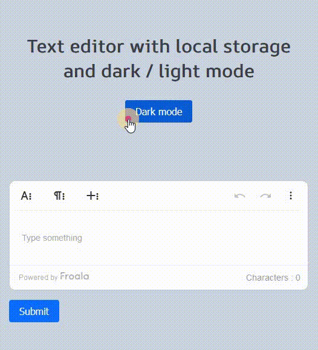

# React - Rich text editor

# 🔗 [Live Preview](https://sparkling-pudding-7f7aa9.netlify.app/)

---
## About 👋

This exercise is testing the features of pre-made rich text editor from Froala and all of the features for changing text such as making letters bold, italic, making tables and many more.

What I did here: 
- Implemented this pre-made rich text editor
- Implemented dark / light mode
- Implemented local storage

This is my version of a very similar project (https://youtu.be/O-xgS9G7A6A?si=7DsHtKsrgOY0Xmx5).

---

## Features 👨‍💻

* User can input text which will be saved in local storage. When the page is reloaded and user comes back the input text will remain

* User can toggle between dark and light mode

---

## Languages

* Froala: for pre-made rich text editor with all the features 
* React: functions, conditionals
* Sass: for styling
